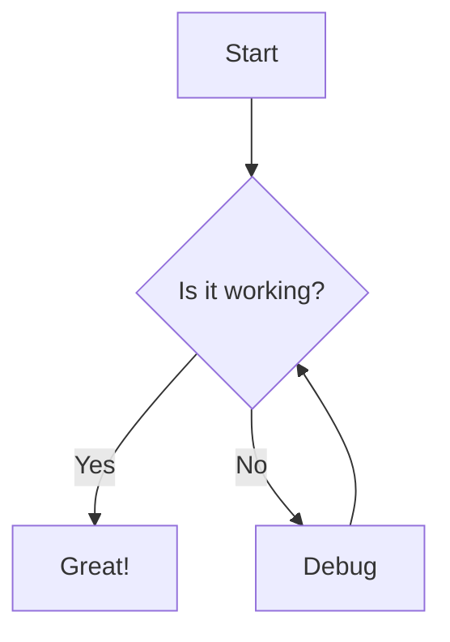

# TaskBot Writing Guide


Welcome to the **TaskBot** documentation editor. Here are the new available features.

## 1. Formatting

**Bold**: `**Text**`
*Italic*: `*Text*`
`Code`: `` `Code` ``

## 2. Alerts & Admonitions

Use these blocks to highlight information.

:::note[Information]
This is a standard note.
:::

:::tip[Pro Tip]
Great for sharing tips or best practices.
:::

:::warning[Warning]
Be careful with this action.
:::

:::danger[Danger Zone]
Critical or irreversible action.
:::

:::success[Success]
Operation completed successfully!
:::

## 3. Content Tabs

Display code or content in tabs.

::::tabs

:::tab[TypeScript]
```typescript title="config.ts"
export const config = {
  debug: true
};
```
:::

:::tab[Python]
```python title="config.py"
config = {
    "debug": True
}
```
:::

::::

## 4. Buttons & Layout

Option 1: Markdown Syntax (Use :: double colons)

:::button[Go to Dashboard]{href="/dashboard" icon="arrow" variant="primary"}

:::button[External Docs]{href="https://google.com" icon="external" variant="secondary"}

:::button[Danger Zone]{variant="danger" icon="warning"}

:::button[Success]{variant="success" icon="check"}

Option 2: Standard HTML (Advanced)

<div class="grid-2">
  <div class="card">
    <h3>🎨 Design</h3>
    <p>Modern interface creation.</p>
    <a href="#" class="btn btn-primary">View Design</a>
  </div>
  <div class="card">
    <h3>📚 Docs</h3>
    <p>Complete documentation.</p>
    <a href="#" class="btn btn-secondary">Read More</a>
  </div>
</div>

<div style="margin-top: 16px;">
  <a href="#" class="btn btn-outline">Outline Button</a>
</div>

## 5. Mathematics

Mathematical formulas with KaTeX: [Official Documentation](https://katex.org/docs/supported.html)

Mass-Energy: $$E = mc^2$$

Integral:
$$
int_{-infty}^infty e^{-x^2} dx = sqrt{pi}
$$

## 6. Mermaid Diagrams

Generate diagrams automatically: [Official Documentation](https://mermaid.js.org/intro/)



## 7. Tables

| ID | User | Role |
| :--- | :--- | :--- |
| 1 | @Antigravity | **Admin** |
| 2 | @User | Member |

---
*TaskBot Team*
