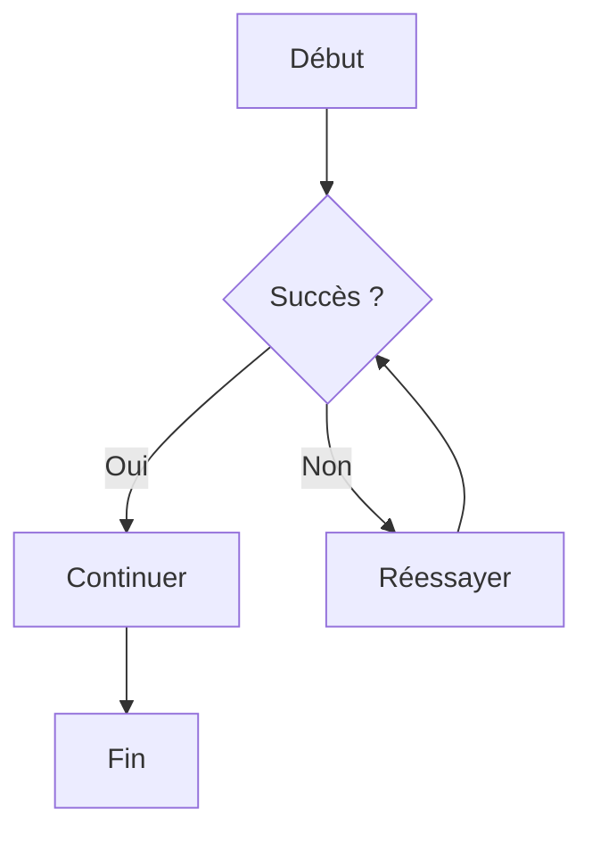

# Guide de Rédaction TaskBot

  <h3>Titre</h3>
  
Contenu...

  
Item 1

  
Item 2

:::button[Labkel]{href="#" variant="primary" icon="arrow"} 

Bienvenue dans l'éditeur de documentation de **TaskBot**.

## 1. Nouveautés de l'Éditeur
- **📊 Tableaux** : Cliquez sur le bouton "Table" pour générer un tableau de la taille de votre choix.
- **🧩 Composants** : Utilisez le menu "Add" pour insérer rapidement des boutons, cartes, grilles et alertes.
- **👁️ Synchro Défilement** : Désactivée par défaut, activez-la dans les options (🛠️).

## 2. Mise en forme & Composants

### Boutons
:::button[Voir la documentation]{href="/docs" variant="primary" icon="arrow"} 

:::button[Version Github]{href="https://github.com" variant="secondary" icon="external"} 
:::button[Zone Danger]{href="#" variant="danger" icon="warning"}

### Cartes Grid

  

    <h3>🎨 Design</h3>
    
Interface intuitive et moderne.

  

  

    <h3>⚡ Performance</h3>
    
Optimisation maximale.

  

## 3. Diagrammes (Mermaid)
TaskBot supporte les diagrammes Mermaid. [Documentation Officielle](https://mermaid.js.org/intro/)

Utilisez le bloc de code `mermaid` pour générer des graphiques, flowcharts, séquences, etc.

**Syntaxe de base :**
- `graph TD;` : Définit un graphe orienté Haut -> Bas (Top-Down).
- `A --> B;` : Crée une flèche simple de A vers B.
- `A[Texte];` : Crée un nœud rectangulaire avec du texte.
- `A{Condition};` : Crée un losange pour les conditions.

Exemple :

## 4. Mathématiques (KaTeX)
Utilisez KaTeX pour écrire des formules mathématiques scientifiques. [Documentation Officielle](https://katex.org/docs/supported.html)

- Utilisez `$$ ... $$` pour un bloc mathématique centré.

**Symboles courants :**
- `\int` : Intégrale, `\sum` : Somme, `\sqrt{x}` : Racine carrée
- `a^b` : Exposant, `a_b` : Indice
- `\frac{a}{b}` : Fraction

Exemples :
$$
E = mc^2
$$
$$
\int_{-\infty}^\infty e^{-x^2} dx = \sqrt{\pi}
$$

## 5. Tableaux Supportés
| Fonctionnalité | Supporté |
| :--- | :---: |
| Tables | ✅ |
| Diagrammes | ✅ |
| Math | ✅ |

## 6. Onglets & Alertes

:::tabs
::tab[Onglet 1]
Contenu de l'onglet 1

::tab[Onglet 2]
Contenu de l'onglet 2
:::

::tab[Attention]
:::warning[Attention]
Soyez prudent ici.
:::

