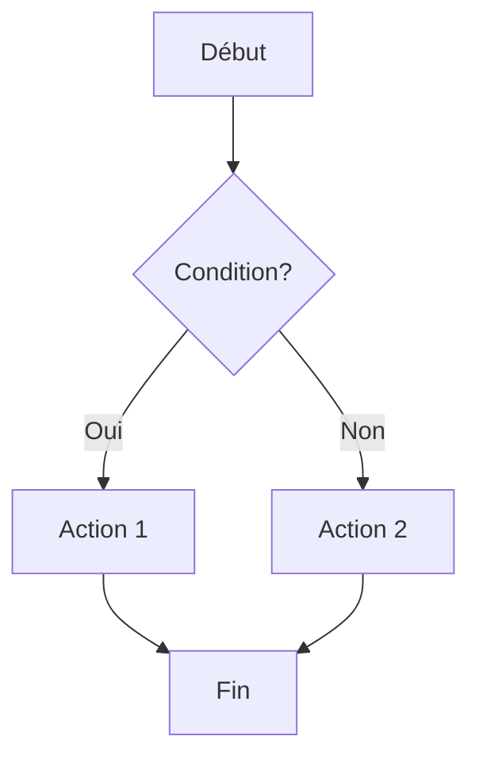

# Guide de Rédaction TaskBot


Bienvenue dans l'éditeur de documentation de **TaskBot**. Utilisez le menu **🧩 Add** pour insérer rapidement des composants.

---

## 1. Cartes & Grilles

### Carte Simple
:::card[Ma Fonctionnalité]{icon="🚀"}
Description de la carte...
:::

### Carte avec Image
:::card[Titre]{image="https://raw.githubusercontent.com/FreeProject089/Docs_TaskBot/refs/heads/main/docs/assets/images/1768509997840-Capture_d__cran_2025-12-04_201515.png" icon="🎨"}
Description avec image en header...
:::

### Carte avec Liens
:::card[Ressources]
- [Documentation](#)
- [API Reference](#)
- [Exemples](#)
:::

### Grille de Cartes
:::grid{cols=2}
:::card[Carte 1]{icon="🎯"}
Contenu de la première carte.
:::

:::card[Carte 2]{icon="📊"}
Contenu de la deuxième carte.
:::
:::

:::grid{cols=4}
:::card[A]{icon="⚡"}
Contenu
:::

:::card[B]{icon="🔧"}
Contenu
:::

:::card[C]{icon="📚"}
Contenu
:::

:::card[D]{icon="🎮"}
Contenu
:::
:::

---

## 2. Éléments Interactifs

### Étapes Numérotées
:::steps
1. **Première étape**
   Description de la première étape.

2. **Deuxième étape**
   Description de la deuxième étape.

3. **Troisième étape**
   Description de la troisième étape.
:::

### Accordéon / Détails
:::accordion[Cliquez pour développer]
Contenu caché qui apparaît quand on clique.
:::

:::details[Plus d'informations]
Détails supplémentaires ici...
:::

### Tooltip
Survolez ce texte pour voir le :::tooltip[tooltip]{content="Information au survol"}.

### Onglets
::::tabs
:::tab[TypeScript]
```typescript title="config.ts"
export const config = {
  debug: true
};
```
:::

:::tab[Python]
```python title="config.py"
config = {
    "debug": True
}
```
:::
::::

---

## 3. Alertes & Admonitions

:::note[Information]
Ceci est une note informative.
:::

:::tip[Astuce]
Conseil utile pour les utilisateurs.
:::

:::warning[Attention]
Soyez prudent avec cette action.
:::

:::danger[Danger]
Action critique ou irréversible !
:::

:::success[Succès]
Opération complétée avec succès !
:::

---

## 4. Diagrammes Mermaid

Générez des diagrammes automatiquement : [Documentation Officielle](https://mermaid.js.org/intro/)



---

## 5. Mathématiques (KaTeX)

Formules mathématiques avec KaTeX : [Documentation Officielle](https://katex.org/docs/supported.html)

Formule en ligne: $E = mc^2$

Bloc mathématique:
$$
\int_{0}^{\infty} e^{-x^2} dx = \frac{\sqrt{\pi}}{2}
$$

---

## 6. Boutons

:::button[Documentation]{href="/docs" variant="primary" icon="arrow"}
:::button[GitHub]{href="https://github.com" variant="secondary" icon="external"}
:::button[Zone Danger]{href="#" variant="danger" icon="warning"}

---

## 7. Tableaux

| Fonctionnalité | Supporté | Notes |
| :--- | :---: | :--- |
| Cartes | ✅ | Avec images et liens |
| Grilles | ✅ | 1-4 colonnes |
| Étapes | ✅ | Numérotation auto |
| Accordéons | ✅ | Dépliables |

---

*TaskBot Team*
